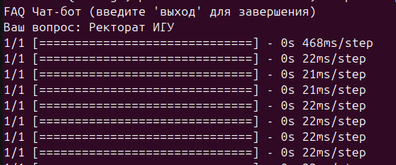
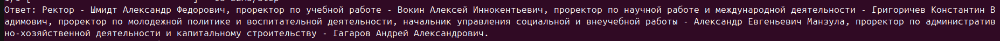

# Чатбот FAQ о вопросах из жизни университета/факультета/кафедры на русском языке.

Для установки зависимостей:
```
pip install -r requirements.txt
```

В проекте также уже есть обученная модель - файл **faq_model.keras**.

Демонстрация работы:





