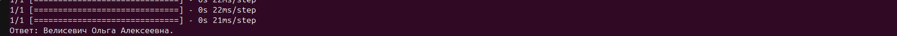

# Чатбот FAQ о вопросах из жизни университета/факультета/кафедры на русском языке.

Для установки зависимостей:
```
pip install -r requirements.txt
```

Для сохранения модели ruBERT рекомендуется отдельно запустить команду в папке с проектом (для этого понадобится Интернет-соединение):
```
python download_model.py
```

В проекте также уже есть обученная модель - файл **faq_model.keras**. Можно использовать ее, сразу запустив основной скрипт (может работать без интернета после того, как сохраните модель ruBERT):
```
python faq_chatbot.py
```

Можно снова обучить модель через команду (тоже работает без Интернета, если сохраните модель ruBERT):
```
python train_model.py
```

Демонстрация работы:



